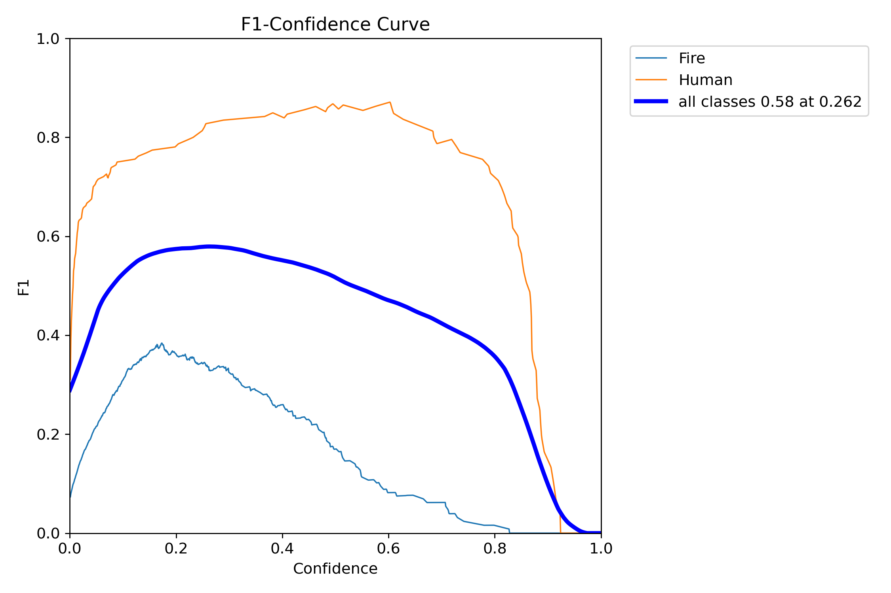
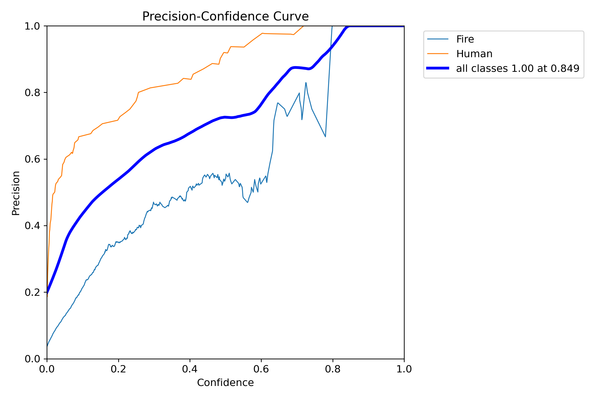
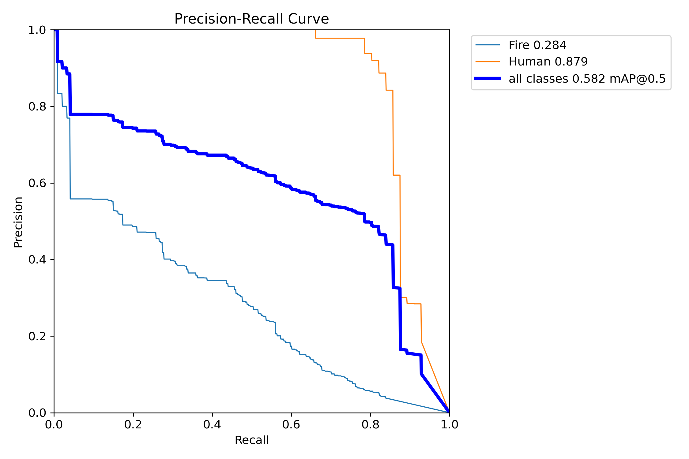
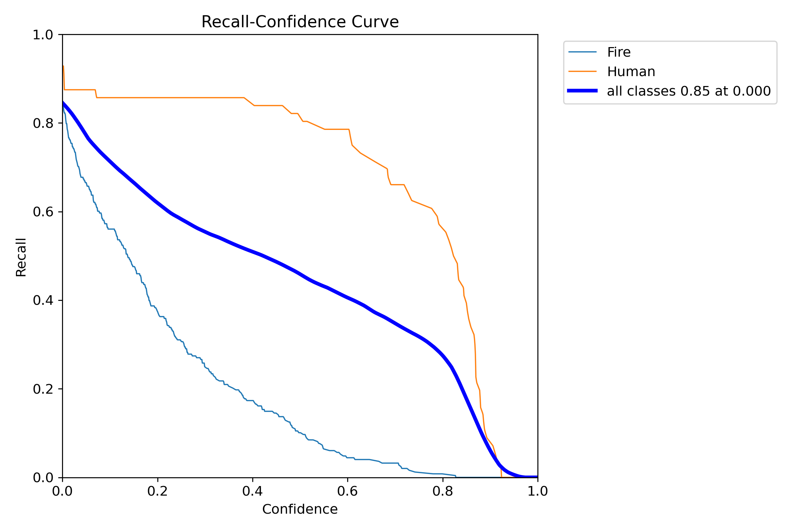
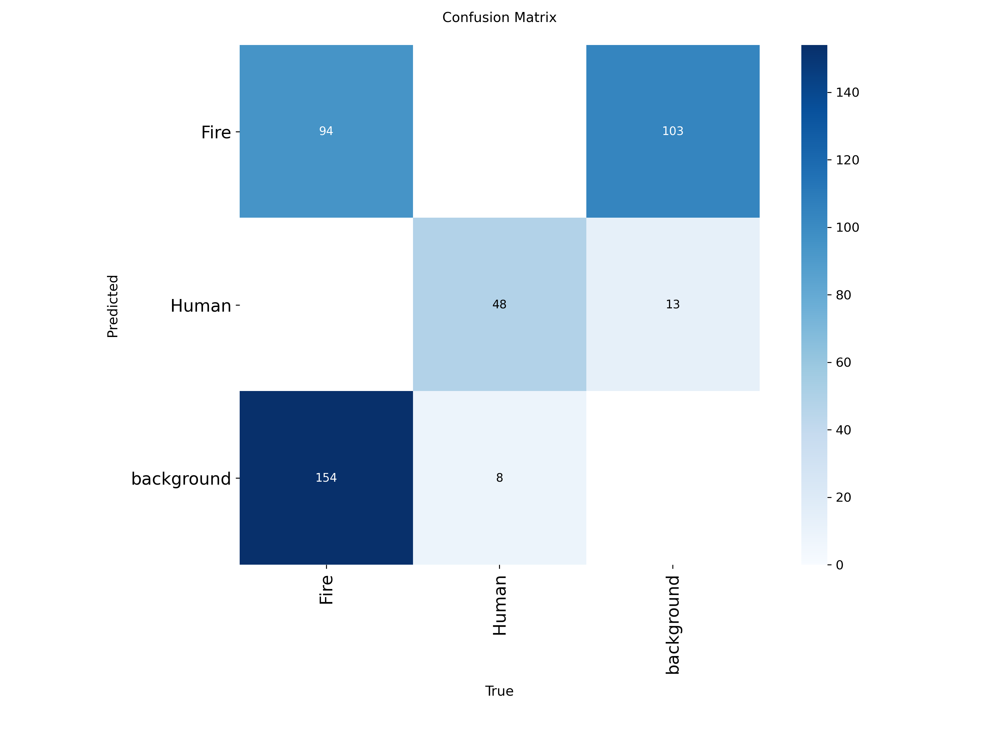
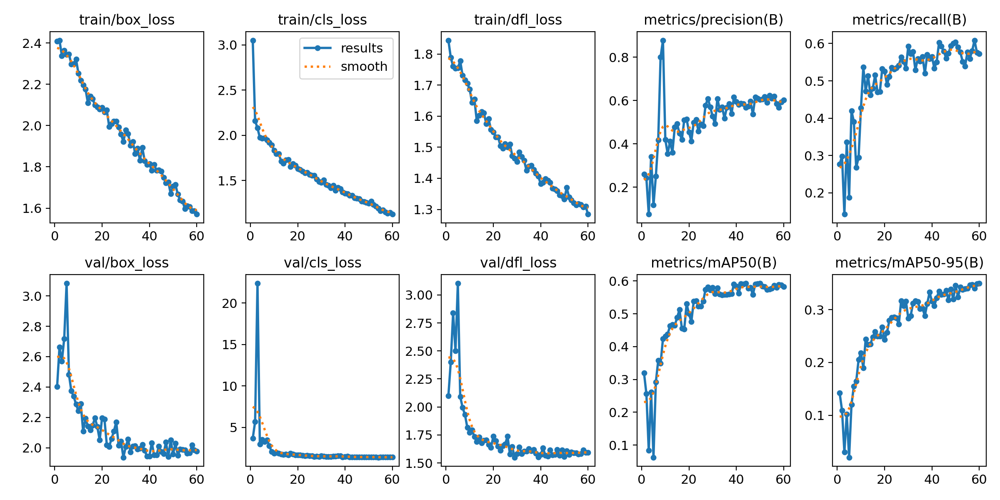

# 🔥 YOLOv8 Fire–Human Detection System

This project demonstrates **multi-image and video-based object detection** using YOLOv8, focused on **fire and human detection**, along with evaluation of key performance metrics on a validation set.

---

# 📊 Project Overview

The project highlights:

- **Fire Detection:** Bounding boxes around visible flames 
- **Human Detection:** Identifying humans near fire scenes  
- **Performance Metrics:** Precision, Recall, F1-Score, mAP, Confusion Matrix  

# Key Insights

- Detection results on images and videos containing fire incidents
- Class-wise performance evaluation for fire and humans
- Training and validation results visualized through graphs
- Metrics to analyze real-world fire detection reliability

---

# 🛠 Tools Used

- Python
- Ultralytics YOLOv8
- OpenCV
- NumPy
- PyTorch

---

# 📂 Project Files

- **yolo_detect.py** → Script for image/video inference
- **my_model.pt** → Trained YOLOv8 model
- **Results** → Training outputs:
  - Confusion matrix
  - Precision–Recall curves
  - Loss graphs
  - mAP plots
- **Outputs** → Detected images and videos
- **README.md** → Project documentation

---

# 📦 Dataset

The dataset is **not included in this repository** due to GitHub file size limitations.

**👉 Download the dataset here:**

🔗 https://drive.google.com/file/d/1MKz0vnE9D02ccElSRMXhZWsiKYIwyEAC/view?usp=sharing

**Dataset Details**

- Format: **YOLO**
- Classes:
  - 0 → Fire
  - 1 → Human
 
  ---

  # 📸 Sample Outputs

  

  

  # 📊 Evaluation Metrics & Graph Analysis

  After training the YOLOv8 model, multiple evaluation metrics and graphs were generated to assess detection performance.

  **🔹 F1–Confidence Curve**

  

  **🔹 Precision–Confidence Curve**

  

  **🔹 Precision–Recall Curve**

  

  **🔹 Recall–Confidence Curve**

  

  **🔹 Confusion Matrix**

  
  

  **Training & Validation Metrics Overview**

  
  

