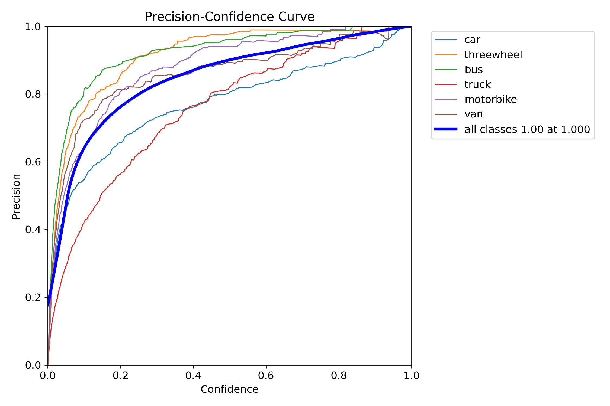
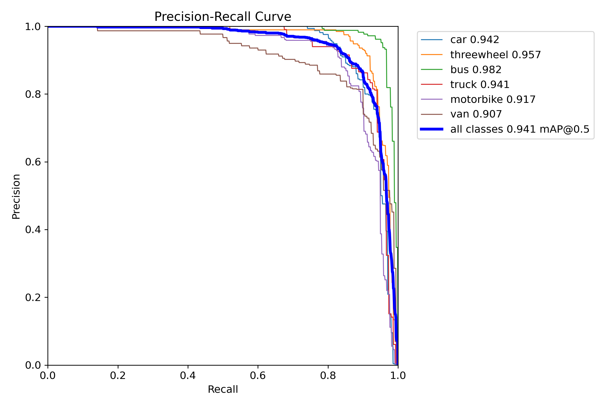
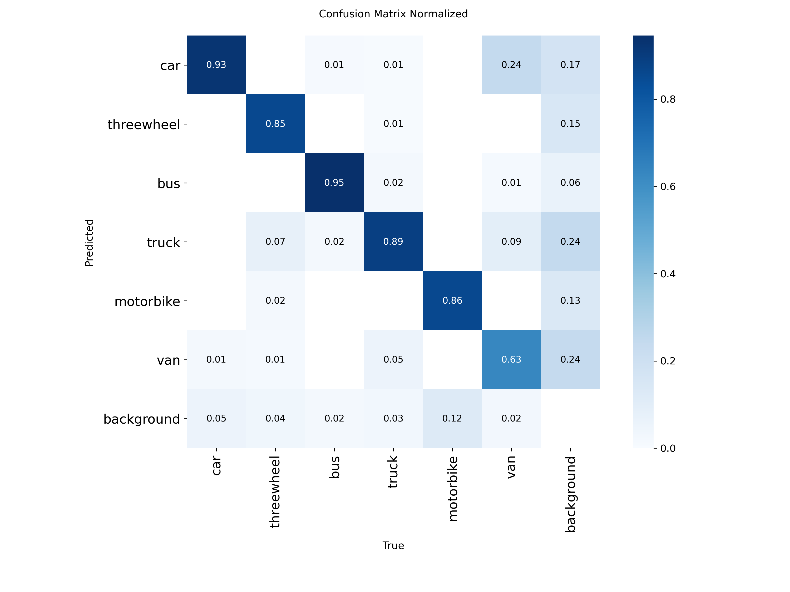
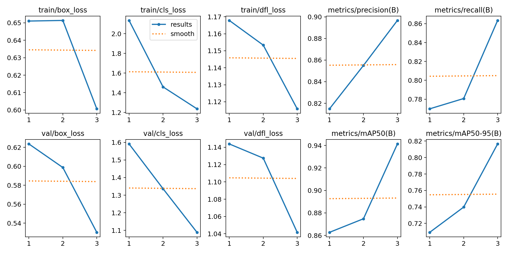

# YOLOv8-Multi-Image-Object-Detection-and-Segmentation

This project demonstrates **multi-image object detection and segmentation** using YOLOv8, along with evaluation of key performance metrics on a validation set.

---

## 📊 Project Overview

The project highlights:

- **Object Detection:** Bounding boxes around multiple objects  
- **Object Segmentation:** Colored masks over detected objects  
- **Performance Metrics:** Precision, Recall, F1-Score, mAP, Confusion Matrix  

### Key Insights

- Detection and segmentation results on validation images  
- Class-wise performance evaluation  
- Training and validation results visualized through plots  
- Metrics for overall model performance and class distinctions  

---

## 🛠 Tools Used

- **Python & Ultralytics YOLOv8** → For object detection and segmentation  
 

---

## 📂 Project Files

- **main.py** → Script for detection, segmentation, and training  
- **data.yaml** → Dataset configuration (train/validation paths + classes)  
- **runs/** → Folder containing model outputs:  
  - **Detection/** → Sample detection images  
  - **Segmentation/** → Sample segmentation images  
  - **Results-after-training/** → Training, validation, and evaluation metrics images  
- **README.md** → Project documentation  

---

## 🚀 How to Use

1. Download or clone this repository.  
2. Download the full dataset from Kaggle:  
   [Vehicle Dataset for YOLO](https://www.kaggle.com/datasets/nadinpethiyagoda/vehicle-dataset-for-yolo)
3. Place the dataset in the following structure:


4. Run detection and segmentation on sample images:

```bash
python main.py
```

5. Check **runs/** folder for detection, segmentation, and training results.

---

## 📸 Sample Outputs

## Detection-Example


## Segmentation-Example


---

## 📊 Evaluation Metrics & Graph Analysis

After training the YOLOv8 model, several evaluation metrics and graphs are generated to measure detection and segmentation performance. Below is a brief explanation of each:

## F1-Confidence Curve


The F1–Confidence curve shows how the model’s F1 score (balance between precision and recall) changes with different confidence thresholds.

In this graph: The overall F1 score peaks at 0.88 when the confidence is around 0.489, indicating this is the optimal threshold for best detection performance across all classes.

## Precision–Confidence Curve



This curve shows how precision (the proportion of correct detections) changes as the model’s confidence threshold increases.

Higher confidence thresholds reduce false positives but may miss some objects. The model achieves near-perfect precision (≈1.0) at a confidence level of 1.0, indicating strong accuracy across all vehicle classes.

## Precision–Recall Curve



This curve illustrates the trade-off between precision (accuracy of positive predictions) and recall (ability to find all relevant objects) for each vehicle class.

Models with curves closer to the top-right corner indicate stronger performance. Here, the YOLO model achieves a mean Average Precision (mAP@0.5) of 0.941, showing excellent detection accuracy across all classes — with the bus (0.982) and threewheel (0.957) performing best, while van (0.907) shows slightly lower precision.

## Recall-Confidence Curve


This curve shows how recall (the proportion of correctly detected objects) changes as the model’s confidence threshold increases.

Higher confidence thresholds make the model more selective, which can reduce recall. The model maintains a high recall (≈0.99) at lower confidence levels, indicating strong detection coverage across all vehicle classes.

## Confusion-matrix



This matrix shows how well the model correctly classifies each vehicle class compared to others.

Darker diagonal cells indicate higher accuracy for that class. The model performs strongly overall, with high correct prediction rates for bus (0.95), car (0.93), and truck (0.89), while van (0.63) shows more misclassifications, suggesting room for improvement in that category.

## Training & Validation Metrics Overview



This figure displays the evolution of key training and validation metrics across epochs for an object detection model.

- **Loss Curves (Box, Cls, DFL):** Both training and validation losses steadily decrease, indicating effective learning and reduced prediction errors. 
- **Precision & Recall:** These metrics improve consistently, showing that the model is becoming both more accurate and more sensitive to detecting true objects.
- **mAP@50 and mAP@50–95:** The increasing mean Average Precision demonstrates enhanced detection performance and generalization across IoU thresholds.

Overall, the plots show smooth convergence and balanced improvement between training and validation, suggesting a stable and well-trained model.

---

## 🔑 Learnings & Takeaways

- **Preparing YOLOv8 datasets for multi-image detection and segmentation**   
- **Running detection and segmentation pipelines with pretrained models**
- **Understanding and interpreting Precision, Recall, F1-Score, mAP, and Confusion Matrix**
- **Visualizing results and model performance on validation datasets**

