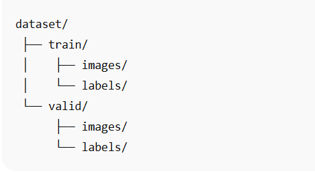

# YOLOv8-Multi-Image-Object-Detection-and-Segmentation

This project demonstrates **multi-image object detection and segmentation** using YOLOv8, along with evaluation of key performance metrics on a validation set.

---

## 📊 Project Overview

The project highlights:

- **Object Detection:** Bounding boxes around multiple objects  
- **Object Segmentation:** Colored masks over detected objects  
- **Performance Metrics:** Precision, Recall, F1-Score, mAP, Confusion Matrix  

### Key Insights

- Detection and segmentation results on validation images  
- Class-wise performance evaluation  
- Training and validation results visualized through plots  
- Metrics for overall model performance and class distinctions  

---

## 🛠 Tools Used

- **Python & Ultralytics YOLOv8** → For object detection and segmentation  
- **OpenCV & NumPy** → For image processing and handling  
- **Matplotlib / Ultralytics plots** → For metrics visualization  

---

## 📂 Project Files

- **main.py** → Script for detection, segmentation, and training  
- **data.yaml** → Dataset configuration (train/validation paths + classes)  
- **runs/** → Folder containing model outputs:  
  - **Detection/** → Sample detection images  
  - **Segmentation/** → Sample segmentation images  
  - **Results-after-training/** → Training, validation, and evaluation metrics images  
- **README.md** → Project documentation  

---

## 🚀 How to Use

1. Download or clone this repository.  
2. Download the full dataset from Kaggle:  
   [Vehicle Dataset for YOLO](https://www.kaggle.com/datasets/nadinpethiyagoda/vehicle-dataset-for-yolo)
3. Place the dataset in the following structure:



4. Run detection and segmentation on sample images:

```bash
python main.py
```

5. Check **runs/** folder for detection, segmentation, and training results.

---

## 📸 Sample Outputs

## Detection-Example


## Segmentation-Example


## Metrics


---


## 🔑 Learnings & Takeaways

- **Preparing YOLOv8 datasets for multi-image detection and segmentation**   
- **Running detection and segmentation pipelines with pretrained models**
- **Understanding and interpreting Precision, Recall, F1-Score, mAP, and Confusion Matrix**
- **Visualizing results and model performance on validation datasets**

