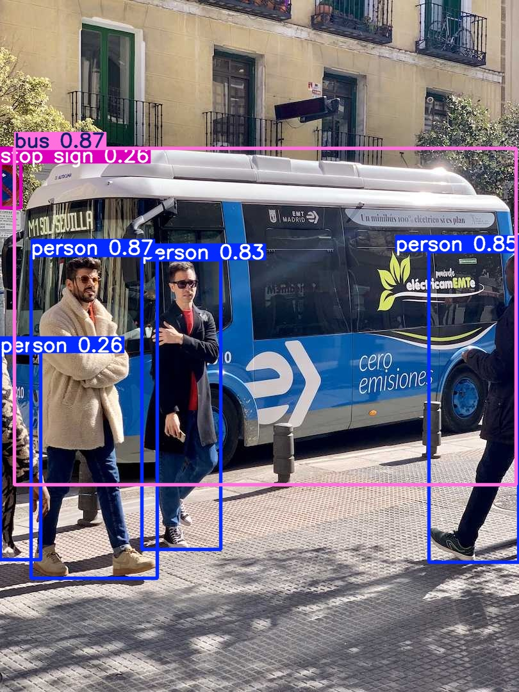
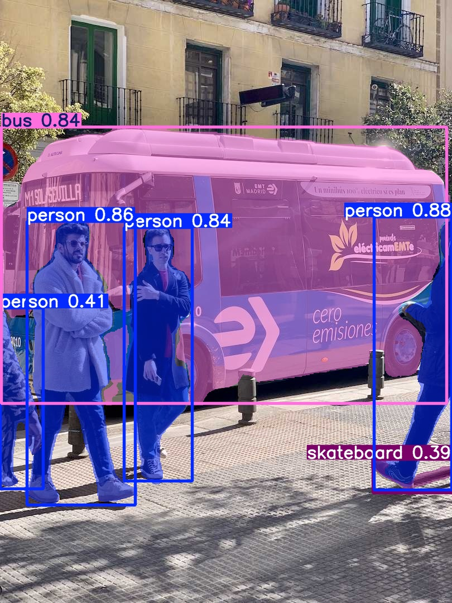

# Object-Detection-and-Segmentation-YOLOv8

This project demonstrates **object detection** and **segmentation** on images using **Ultralytics YOLOv8** models. It predicts objects and segments regions in a sample image (`bus.jpg`), saving the results in organized folders.

---

## 📊 Project Overview

The project highlights:

- **Object Detection:** Using `yolov8n.pt`  
- **Object Segmentation:** Using `yolov8n-seg.pt`  
- **Automatic Output Saving:** Results are stored in organized folders  

### Key Features

- Detection of objects in images  
- Segmentation of object regions  
- Outputs saved in `runs/detect/` and `runs/segment/`  
- Easy to run with a single Python script  

---

## 🛠 Tools Used

- **Python ≥ 3.8** → Programming language  
- **Ultralytics YOLOv8** → Pre-trained models for detection and segmentation  

---

## 📂 Project Files

- **main.py** → Python script to run detection and segmentation  
- **bus.jpg** → Sample input image for predictions  
- **runs/detect/** → Output folder for detection results  
- **runs/segment/** → Output folder for segmentation results  
- **README.md** → Project documentation  

---

## 🚀 How to Use

Open a terminal and follow these **bash commands**:

```bash
# Clone the repository
git clone https://github.com/your-username/object-detection-and-segmentation.git
cd object-detection-and-segmentation

# Install dependencies
pip install ultralytics

# Run the main script
python main.py
# Clone the repository
git clone https://github.com/your-username/object-detection-and-segmentation.git
cd object-detection-and-segmentation

# Install dependencies
pip install ultralytics

# Run the main script
python main.py

```bash
---

## 📸 Results Preview





---

## Learnings from the project:
echo "1. Loading and using pre-trained YOLOv8 models"
echo "2. Performing object detection and segmentation on images"
echo "3. Saving and organizing prediction outputs"
echo "4. Understanding workflow for deep learning image projects"

